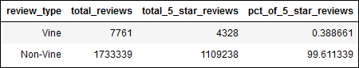
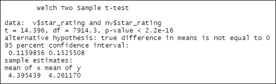
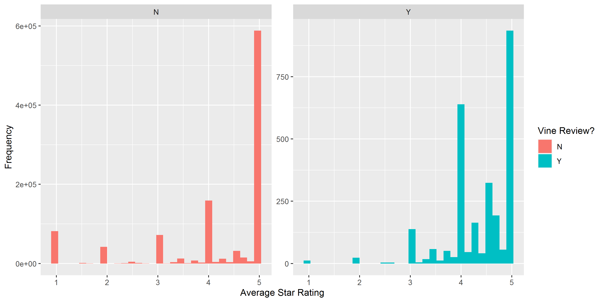

# Module 16 Challenge - Amazon Vine Analysis - AWS and PySpark

## Overview

Project Origination Date: 2021-09-21

### Purpose

The purpose of this analysis is to analyze Amazon reviews written by members
of the paid Amazon Vine Program.

For this analysis, the `us_Tools_v1_00` Dataset will be used.

### Tasks

1. Choose a dataset from the collection of Amazon Example Product Reviews
	- For purposes of this analysis, the `us_Tools_v1_00` Dataset will be used.
2. Use PySpark to perform the ETL process to extract the dataset, transform the data,
connect to an AWS RDS instance, and load the transformed data into a PostgreSQL Database
3. Use PySpark, Pandas, or SQL to determine if there is any bias toward favorable reviews
from Vine members in the selected dataset.
4. Write a summary of the analysis (this README.md)

### Approach

1. Create a PostgreSQL Database Hosted on Amazon AWS.
2. Connect to this database via pgAdmin.
3. Within pgAdmin, create tables using client-provided pre-defined schema.
4. Import provided Starter Code to Google Colab Notebook.
5. Extract one of the review datasets, and create a new DataFrame containing the data.
6. Transform the dataset into four DataFrames that will match the schema in the pgAdmin tables.
7. Determine bias of Vine Reviews

### Deliverables

1. Perform ETL on Amazon Product Reviews
2. Determine Bias of Vine Reviews
3. Provide a Written Report on the Analysis (this README.md)

Jump to [Deliverables](#deliverables-1)

### Resources

- Software:
	- PostgreSQL Database, hosted on Amazon Web Services
	- pgAdmin 4, Version 5.2
	- Google Colab Notebooks (https://colab.research.google.com)
	- Jupyter notebook server 6.3.0, running Python 3.7.10 64-bit (Dependencies: os, pandas)
	- R Version 4.1.1 (2021-08-10) (Libraries: dplyr, ggplot2)
	- RStudio Version 1.4.1717
- Data:
	- `https://s3.amazonaws.com/amazon-reviews-pds/tsv/amazon_reviews_us_Tools_v1_00.tsv.gz`
		- Sample dataset of Amazon Product reviews, obtained from Amazon Web Services
		- Downloaded/Accessed: 2021-09-21
		- Not hosted here due to public availability, and to conserve resources
	- `Amazon_Reviews_ETL_starter_code.ipynb`
		- Client-provided Starter Code
		- Imported to Google Colab Notebook and renamed `Amazon_Reviews_ETL.ipynb`
		- Upon completion, sensitive data was removed and `Amazon_Reviews_ETL.ipynb` was exported and saved locally to disk. This is the version accessible in this GitHub Repository.
	- `data/vine_table.csv`
		- User-Exported Comma-Separated-Values file of the `vine_table` Table from AWS/pgAdmin, according to the Instructions provided for Deliverable 1 & Deliverable 2.
	- `Vine_Review_Analysis.ipynb`
		- User-Created Jupyter Notebook Python 3 Code to process `vine_table.csv`, according to the Instructions provided for Deliverable 2.

Additional information about `amazon_reviews_us_Tools_v1_00.tsv` is outlined below in Tables 1 & 2.

**Table 1: Source Data Description**
| File Name                               | Brief Description of Contents
|-----------------------------------------|------------------------------
| `amazon_reviews_us_Tools_v1_00.tsv` | Tab-Delimited Plaintext File without quote or escape characters, containing Amazon Product Reviews from the Tools Category. First line is Header, remainder of file 1 line corresponds to 1 record. 1,741,101 Lines Containing 1 Header Row and 1,741,100 Reviews with Metadata. Data is taken from United States Marketplace. All Metadata and most reviews are in English. Data is primarily represented using the Basic Latin ASCII Character Set, but there are some Latin-1 Supplement and Latin Extended ASCII and Non-ASCII Unicode Characters present, most frequently punctuation and symbols such as Registered Trademark, smart quotes, and en dashes. Appearing less frequently, but also present are non-Latin language characters from various world alphabets such as Cyrillic, Greek, Hebrew, Arabic, Korean, Chinese, Japanese, Emoji, Mathematical Symbols, and Diacritics. 15 Fields, described in greater detail below in Table 2.

**Table 2: `amazon_reviews_us_Tools_v1_00.tsv` Fields**
| Field Name                              | Amazon Original Description of Contents                                                                                                                                    | Additional Explanation of Contents
|-----------------------------------------|----------------------------------------------------------------------------------------------------------------------------------------------------------------------------|-----------------------------------
| `marketplace`                           | 2 letter country code of the marketplace where the review was written.                                                                                                     | All entries are in `US` for 'United States'.
| `customer_id`                           | Random identifier that can be used to aggregate reviews written by a single author.                                                                                        | 1,053,515 Unique Customer ID Numbers. ID Numbers are purely numeric with 5-8 digits. Min: 10027, Max: 53096511.
| `review_id`                             | The unique ID of the review.                                                                                                                                               | Unique Alphanumeric Review ID. Ranging in length from 10-14 characters. All Review ID's Begin with 'R'.
| `product_id`                            | The unique Product ID the review pertains to. In the multilingual dataset the reviews for the same product in different countries can be grouped by the same `product_id`. | 183,810 Unique Alphanumeric Product ID's. All ID's have a length of 10 characters.
| `product_parent`                        | Random identifier that can be used to aggregate reviews for the same product.                                                                                              | 166,372 Unique Product Parent ID Numbers. ID Numbers are purely numeric with 3-9 digits. Min: 538, Max: 999989950.
| `product_title`                         | Title of the product.                                                                                                                                                      | 167,530 Free Text Product Titles. Ranging in length from 1-400 characters.
| `product_category`                      | Broad product category that can be used to group reviews (also used to group the dataset into coherent parts).                                                             | Free Text Product Title. All entries are in `Tools`.
| `star_rating`                           | The 1-5 star rating of the review.                                                                                                                                         | Numeric star rating of the review. Length of 1 digit. Min: 1, Max: 5.
| `helpful_votes`                         | Number of helpful votes.                                                                                                                                                   | Numeric count of helpful votes of the review. Ranging in length from 1-4 digits. Min: 0, Max: 4760.
| `total_votes`                           | Number of total votes the review received.                                                                                                                                 | Numeric count of total number of votes of the review. Ranging in length from 1-4 digits. Min: 0, Max: 4858.
| `vine`                                  | Review was written as part of the Vine program.                                                                                                                            | Alphabetic Pseudo-Boolean value. Length of 1 character. Possible values: `N` for 'No', review was not written as part of the Vine Program, `Y` for 'Yes', review was written as part of the Vine Program.
| `verified_purchase`                     | The review is on a verified purchase.                                                                                                                                      | Alphabetic Pseudo-Boolean value. Length of 1 character. Possible values: `N` for 'No', review was not written for a Verified Purchase, `Y` for 'Yes', review was written for a Verified Purchase.
| `review_headline`                       | The title of the review.                                                                                                                                                   | 932,228 Unique Free Text Review Headlines. Ranging in length from 1-128 characters.
| `review_body`                           | The review text.                                                                                                                                                           | 1,591,365 Unique Free Text Reviews. Ranging in length from 0-43,791 characters. All reviews with 0 characters in `review_body` do have non-NULL `review_headline`.
| `review_date`                           | The date the review was written.                                                                                                                                           | 5,770 Unique Gregorian Calendar Dates in the format of '%Y-%m-%d'. Least-Recent: 1999-11-09, Most-Recent: 2015-08-31.
                                            
#### Data Quality                           

With the exception of the presence of non-Latin characters and symbols in the Free Text fields (16,961 lines contain at least 1 non-ASCII Character), the quality of this dataset is overall very good and reliable.
[At least from the standpoint of Metadata, without discussing the veracity of the contents themselves.]

All fields contain consistent and expected values, few if any NULL values, and proper rules are being applied and adhered to for the allowed values within each given field.

A cursory review has revealed some reviews written in French.

#### Profanity Check

Out of curiosity, and as a way to test the hypothesis that strongly-worded reviews can be informative, the Review Headline and Review Body text were compared against George Carlin's Seven Words You Can't Say on TV.
As a first pass, the seven words were included with simple lowercase spellings, with one added variant known already to be present within the text ($#!t). Word boundaries were not enforced, because some reviewers
have some creative coinages and we did not want to ignore these creations (such as 'EHOLYSHITBALZE!!').

There are some false positives such as 'mishits', 'pushit', 'butits', French language reviews using the word 'petits', and Brand Names (either properly or improperly spelled) like 'Matsushita', or 'Bostitsch' (sic).
More work could be done to derive more variants of profane words made up of known common spelling variations and punctuation character substitution to find more profane reviews,
and false positives could be reduced by compiling a whitelist of brand names and benign words which themselves innocently contain spellings of profane words (e.g. 'analysis').

'Piss' is the most-frequently appearing profane word among the seven searched for, and most-often appears with its intended
pejorative sense and not as part of a false-positive making up some other word. In the absence of other more comprehensive means of analysis, a 'piss' check could be a way to quickly find
your most-dissatisfied customers!

A cursory review reveals that those reviewers who took the time to mention Jeff Bezos by name do so more often to criticize than to praise.

One final caution is to remember the flexibility and variability of profanity. 'Shit' is commonly mentioned in negative product reviews, but 'the shit' is high praise. Similarly, 'the tits' signifies a highly positive review,
while the mention of 'tits up' would likely be in reference to something to consider avoiding.

## Deliverables

### Deliverable 1

See `Amazon_Reviews_ETL.ipynb`

### Deliverable 2

See `Vine_Review_Analysis.ipynb`

#### Note for Reviewer:

For Deliverable 2 Instruction #5., I intentionally followed the instructions quite deliberately as written, without using the results as previously
determined in Deliverable 2 Instructions #1.-#4. This being a Computer Programming Exercise, I thought as a Computer would and followed the instructions exactly as written, and did
not attempt to interpret some other form of intended instruction.

I thought that the intention of the instruction may have been to use either the DataFrame
containing only rows with a `total_vote` count greater-than-or-equal-to 20 created in Instruction #1., or the DataFrame containing only rows with a `total_vote`
count greater-than-or-equal-to 20 *AND* with the number of `helpful_votes` greater-than-or-equal-to 50% of the `total_votes` created in Instruction #2.

However, this intention was not made clear or requested in Instruction #5., and furthermore the present form of the analysis makes no use of the vote count information in any way.
Moreover, further down listed under the **Deliverable 2 Requirements**, sub-bullet point #6 which corresponds to the tasks for Instruction #5. states:
"The *total* number of reviews, the number of 5-star reviews, and the percentage 5-star reviews are calculated for *all* Vine and non-Vine reviews" (emphasis added).

Therefore, for Instruction #5. I reverted to using the original DataFrame as imported, containing *all* reviews, and relied on a simple count of review type to obtain and calculate the results requested.
If my interpretation of this instruction is incorrect, I can re-run the analysis to obtain a different result as necessary, according to the desired instruction intention.

## Results

The summary table of analysis from Deliverable 2, Instruction #5, in `Vine_Review_Analysis.ipynb` is shown here as Figure 1 for
reference while considering the questions below.

**Figure 1: Vine Review Analysis Results**

- Q: How many Vine reviews and non-Vine reviews were there?
    - A:
		- Vine Reviews: 7,761
		- Non-Vine Reviews: 1,733,339

- Q: How many Vine reviews were 5 stars? How many non-Vine reviews were 5 stars?
    - A:
		- Vine Reviews: 4,328
		- Non-Vine Reviews: 1,109,238

- Q: What percentage of Vine reviews were 5 stars? What percentage of non-Vine reviews were 5 stars?
    - A:
		- Vine Reviews: 0.3887%
		- Non-Vine Reviews: 99.6113%

## Summary

### Is there any positivity bias for reviews in the Vine Program?

Based solely on the analysis above, it would be very difficult to tell. Using a more robust statistical methodology, such as the 
Welch Two Sample t-test, we can compare the Means of all the Star Ratings between the Vine Reviews and Non-Vine Reviews.

Using this test, we can determine that the Mean Star Rating for Vine Reviews is 4.395, and the Mean Star Rating for the Non-Vine Reviews
is 4.261. The p-value obtained from this test was 2.2e-16, meaning that we Reject the Null Hypothesis that the Means are Statistically
Similar, and conclude that they are NOT statistically similar.

The results of this test as performed in R/RStudio are reproduced below in Figure 2.

**Figure 2: Welch Two Sample t-test Results for Vine and Non-Vine Reviews**

Since the Mean Star Rating for Vine Reviews is *higher* than the
Mean Star Rating for Non-Vine Reviews, we can conclude that:

**YES**, there is a positivity bias for reviews in the Vine Program.

Another way to check this interpretation is to visually compare a pair of histograms
for the distribution of Average Star Ratings between Vine and Non-Vine Reviews.

These histograms are shown here in Figure 3.

**Figure 3: Pair of Histograms showing Distribution of Average Star Ratings between Vine and Non-Vine Reviews**

Comparing these two sets, we can see that among the Vine Reviews, 1-Star Reviews occur less frequently than
other-Starred Reviews do as compared to how they appear in the Non-Vine Reviews. Also there is a bias
towards reviews in the range of 4-5 Stars as compared to how they appear in the Non-Vine Reviews.

### What additional analysis could be performed to support these conclusions?

An additional analysis that could be performed to support these conclusions would be to compare the Mean of Star Ratings across different
sub-groups of reviewers, and not just all the Reviews at once.

Group 1: All Reviews 
Group 2: Reviews from Customers who *only* submitted Non-Vine Reviews 
Group 3: Reviews from Customers who submitted *both* Vine and Non-Vine Reviews 
Group 4: Reviews from Customers who submitted *only* Vine Reviews

This analysis was performed via a series of summary operations in R/RStudio, and the results are produced here in Table 3.

**Table 3: Summary of Average Star Rating Among Different Groups of Customers**
| Group           | n               | Average star_rating [All Reviews] | Average star_rating [Non-Vine Reviews Only] | Average star_rating [Vine Reviews Only]
|:---------------:|----------------:|:---------------------------------:|:-------------------------------------------:|:--------------------------------------:
| 1               | 1,053,515       | 4.262                             | 4.261                                       | 4.395
| 2               | 1,050,766       | 4.186                             |                                             |
| 3               |     1,245       | 4.386                             | 4.391                                       | 4.376
| 4               |     1,504       | 4.394                             |                                             |

The results shown in in Table 3 demonstrate that overall, Vine Reviews have a higher Average Star Rating than Non-Vine Reviews, to a statistically
significant degree as discussed previously. Furthermore, among customers who submitted both reviews for the Vine Program and not as part of the Vine Program,
the Vine Reviews from those customers were higher on average than the reviews they had submitted outside the program.

If the difference in Average Star Rating for each customer in this group for their Vine Reviews and Non-Vine Reviews is taken, and then an average of all those
difference values is calculated, the result is 0.0368, a positive number. This means that more often than not, the difference between Vine and Non-Vine
Reviews is a positive difference, on average an increase of 0.0368 Stars per customer between Non-Vine and Vine Reviews.

Performing the analysis in this manner reduces the effect of searching for a Positivity Bias across the whole data set in aggregate, and instead asks the more targeted question:
Is there Positivity Bias for each customer who participates in the Vine Program?

Here again, we can conclude that:

**YES**, on average, there is positivity bias for reviews submitted by customers participating in the Vine Program.

-- END --
